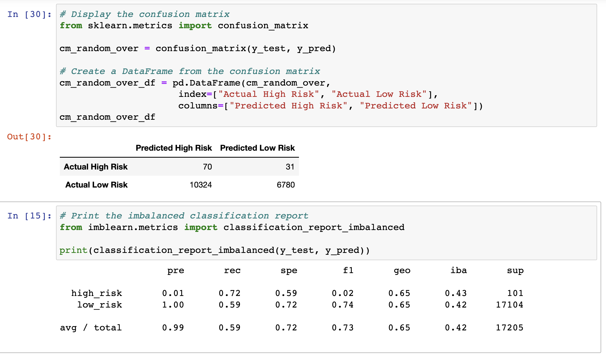
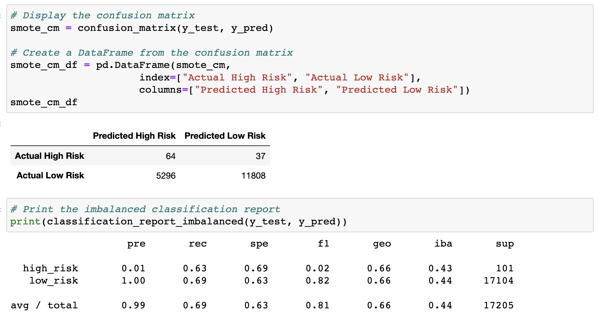
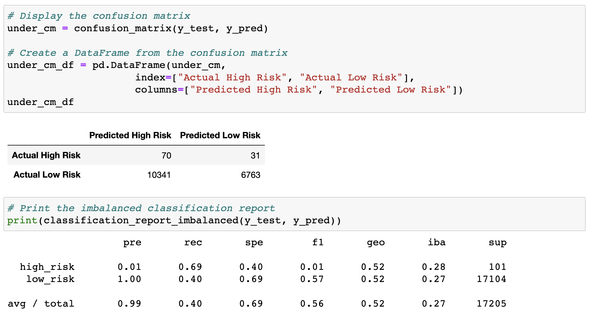
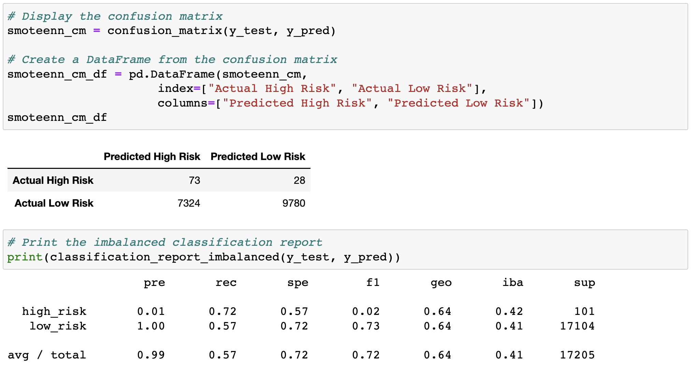
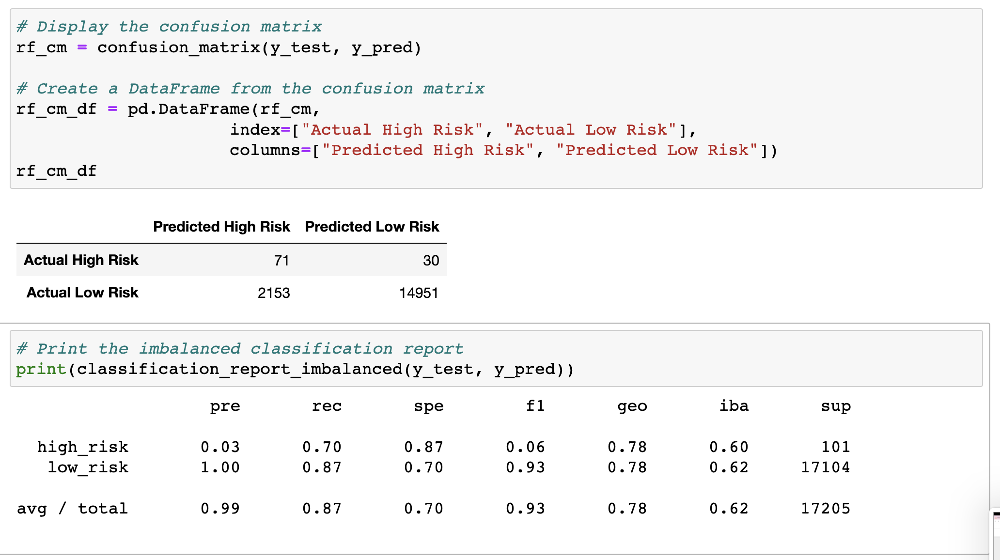
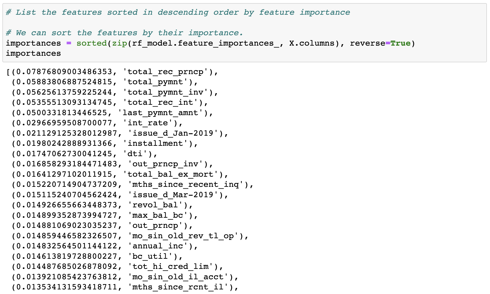
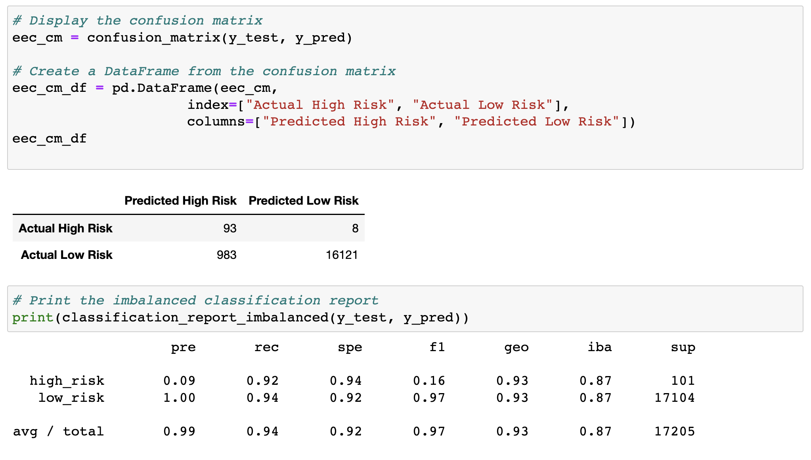

# Credit_Risk_Analysis
Supervised Machine Learning and Credit Risk

## Overview 
**Background and Purpose**

From the credit card dataset from the Lending Club, a peer-to-peer lending services company, we used six different supervised machine learning models to determine if an applicant is high or low risk for the company. Since the credit risk is an unbalanced classification problem, we use different models to train and evaluate the models by resampling. Specifically, we will evaluate the performance of these models and write a recommendation on whether they should be used to predict credit card risk. 

The following are the six specific models that will be tested to determine the best performance: 

- Oversample the data with ```RandomOverSampler``` and ```SMOTE```
- Undersample the data with ```ClusterCentroids``` algorithm
- Combination Approach (Over and Under) with ```SMOTEENN```
- Compare two new machine learning models that reduce bias: ```BalancedRandomForestClassifier``` and ```EasyEnsembleClassifier```


## Resources 
- Original Data Source: [LoanStats_2019Q1.csv](https://github.com/meghanhkoon/Credit_Risk_Analysis/blob/main/Resources/LoanStats_2019Q1.csv)
- Software: Jupyter Notebook, Python, Python Libraries: ```imbalanced-learn``` and ```scikit-learn```, and Anaconda mlenv environment


## Results
After the inital cleaning of the original dataset's "loan_status" column, there were 68,470 low risk and 347 high risk loans. We then split the data into testing and training datasets using the ```train_test_split``` function. In the training set, 51,366 were considered "low risk" and the remaining 246 were "high risk" applications.
```
#Split into Train and Test Sets 
from sklearn.model_selection import train_test_split

X_train, X_test, y_train, y_test = train_test_split(X, y, random_state=1)
```
Next, we used the six different models to determine which was the best for predicting credit risk. The results with balanced accuracy scores, precision and recall scores are as follows:

### Naive Random Oversampling
```RandomOverSampler``` from the ```imbalanced-learn``` library creates a model that uses oversampling. The confusion matrix and classification report are as follows: 

 

- **Balanced Accuracy Score:** 65.47% 
- **"High Risk" Rates:** Precision Rate = 1% and the Sensitivity/ Recall = 69%. 
- **"Low Risk" Rates:** Precision Rate = 100% and the Sensitivity/ Recall = 40%.


### SMOTE Oversampling
The ```SMOTE``` algorithm from the ```imbalanced-learn``` library also uses oversampling in its model. The confusion matrix and classification report are as follows: 



- **Balanced Accuracy Score:** 66.2% 
- **"High Risk" Rates:** Precision Rate = 1% and the Sensitivity/ Recall = 63%. 
- **"Low Risk" Rates:** Precision Rate = 100% and the Sensitivity/ Recall = 69%.


### Undersampling
The ```ClusterCentroids``` resampler identifies clusters from the majority class and generates synthetic data points (centroids) to represent the clusters. After resampling, the trained dataset has 246 high risk and 246 low risk points. The confusion matrix and classification report are as follows: 



- **Balanced Accuracy Score:** 54.42%
- **"High Risk" Rates:** Precision Rate = 1% and the Sensitivity/ Recall = 69%. 
- **"Low Risk" Rates:** Precision Rate = 100% and the Sensitivity/ Recall = 40%.


### Combination (Over and Under) Sampling
Using ```SMOTEENN``` algorithm, the model uses a combination of over and undder sampling algorthims to determine the best performance. The model identifies 68,460 high risk and 62,011 low risk records in the dataset. The confusion matrix and classification report are as follows: 



- **Balanced Accuracy Score:** 64.73%
- **"High Risk" Rates:** Precision Rate = 1% and the Sensitivity/ Recall = 72%. 
- **"Low Risk" Rates:** Precision Rate = 100% and the Sensitivity/ Recall = 57%.


### Balanced Random Forest Classifier
After splitting the data into training and testing sets for the Ensemble learning, we see that there are 51,366 low risk and 246 high risk. Using ```BalancedRandomForestClassifier``` from the ```imblearn``` library, we see the following results: 



- **Balanced Accuracy Score:** 78.85%
- **"High Risk" Rates:** Precision Rate = 3% and the Sensitivity/ Recall = 70%. 
- **"Low Risk" Rates:** Precision Rate = 100% and the Sensitivity/ Recall = 87%.

From this model, we can also identify which features are most important and list them accordingly: 




### Easy Ensemble Classifier 
For the sixth model, we use the ```EasyEnsembleClassifier``` to train and predict the dataset. The results are as follows: 



- **Balanced Accuracy Score:** 93.17%
- **"High Risk" Rates:** Precision Rate = 9% and the Sensitivity/ Recall = 92%. 
- **"Low Risk" Rates:** Precision Rate = 100% and the Sensitivity/ Recall = 94%.


## Summary 
In summary, the results of the six models' performance are as follows: 

- ```RandomOverSampler```: **Balanced Accuracy Score:** 65.47%, **"High Risk" Rates:** Precision Rate = 1% and the Sensitivity/ Recall = 69%, **"Low Risk" Rates:** Precision Rate = 100% and the Sensitivity/ Recall = 40%.
- ```SMOTE``` Oversampling: **Balanced Accuracy Score:** 66.2%, **"High Risk" Rates:** Precision Rate = 1% and the Sensitivity/ Recall = 63%, **"Low Risk" Rates:** Precision Rate = 100% and the Sensitivity/ Recall = 69%.
- ```ClusterCentroids``` Undersampling: **Balanced Accuracy Score:** 54.42%, **"High Risk" Rates:** Precision Rate = 1% and the Sensitivity/ Recall = 69%, **"Low Risk" Rates:** Precision Rate = 100% and the Sensitivity/ Recall = 40%.
- Combination ```SMOTEENN```: **Balanced Accuracy Score:** 64.73%, **"High Risk" Rates:** Precision Rate = 1% and the Sensitivity/ Recall = 72%, **"Low Risk" Rates:** Precision Rate = 100% and the Sensitivity/ Recall = 57%.
- ```BalancedForestClassifier```: **Balanced Accuracy Score:** 78.85%, **"High Risk" Rates:** Precision Rate = 3% and the Sensitivity/ Recall = 70%, **"Low Risk" Rates:** Precision Rate = 100% and the Sensitivity/ Recall = 87%.
- ```EasyEnsembleClassifier```: **Balanced Accuracy Score:** 93.17%, **"High Risk" Rates:** Precision Rate = 9% and the Sensitivity/ Recall = 92%, **"Low Risk" Rates:** Precision Rate = 100% and the Sensitivity/ Recall = 94%.

From this summary, we see that there is a commonality that Low Risk rates generally have a precision rate of 100%. We also see that the High Risk rates tend to be very small at 1% for the first four models. However, when we use the Ensemble Learning algorithms, the precision rate and the sensitivity/ recall rate for High Risk starts to go up. 

When looking at all six models, it is clear that the ```EasyEnsembleClassifier``` model had the best balanced accuracy score of 93.17%. Not only did this model have the highest accuracy score, but it also produced the highest Precision Rate for "High Risk" credit card applicants with a Sensitivity/ Recall rate of 92% (also the highest). The result for predicting "Low Risk" had a Precision rate of 100% while also having the highest Sensitivty/ Recall rate of 94%. Overall, the ```EasyEnsembleClassifier``` is recommended to use to predict credit card risk. 

